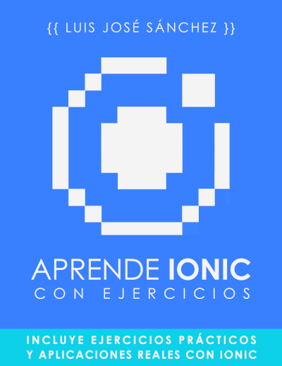
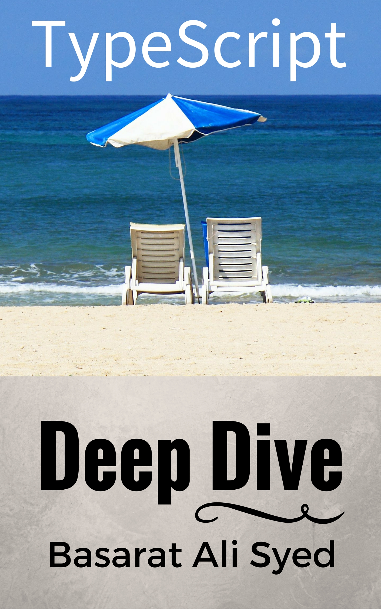
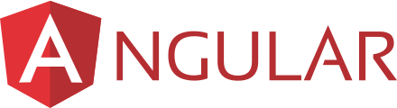

# Ionic

Este documento es la guía de la asignatura **Ionic - Aplicaciones Híbridas** de 2º curso del Ciclo Formativo de Grado Superior de **DAM** (Desarrollo de Aplicaciones Multiplataforma) impartido en las instalaciones del Parque Tecnológico de Andalucía del centro educativo **IES Campanillas (Málaga)**. El profesor de la asignatura es [Luis José Sánchez](https://github.com/LuisJoseSanchez).

## Aprende Ionic con Ejercicios

Descarga del libro: <https://leanpub.com/aprendeionic>

Ejemplos y soluciones a los ejercicios: <https://github.com/LuisJoseSanchez/aprende-ionic-con-ejercicios>

## Aplicaciones de ejemplo en Ionic

* [Calculadora](https://github.com/LuisJoseSanchez/ionic-calculator)
* [Ejercicios básicos](https://github.com/LuisJoseSanchez/ionic-ejercicios-basicos)
* [Lista de tareas](https://github.com/LuisJoseSanchez/ionic-todo-storage)
* [Videos graciosos](https://github.com/LuisJoseSanchez/ionic-funnygifs)

## Aplicación de Ionic

[Enunciado con los requisitos de la aplicación](aplicacion_ionic.pdf)

[TypeScript (página oficial)](https://www.typescriptlang.org/)

[TypeScript Deep Dive - Basarat Ali Syed. Repositorio en GitHub](https://github.com/basarat/typescript-book)

[TypeScript Deep Dive - Basarat Ali Syed. PDF](https://www.gitbook.com/download/pdf/book/basarat/typescript)

[TypeScript Deep Dive - Basarat Ali Syed. Libro en línea](https://basarat.gitbooks.io/typescript/)

[Angular (página oficial)](https://angular.io/)

[Iniciación a Angular. Ejemplos.](https://github.com/LuisJoseSanchez/iniciacion-a-angular)

[Angular University](https://angular-university.io/)

[Ionic (página oficial)](https://ionicframework.com/)

[Repositorio de Ionic en GitHub](https://github.com/ionic-team/ionic)

[Josh Morony - Cursos y blog sobre Ionic](https://www.joshmorony.com/)
